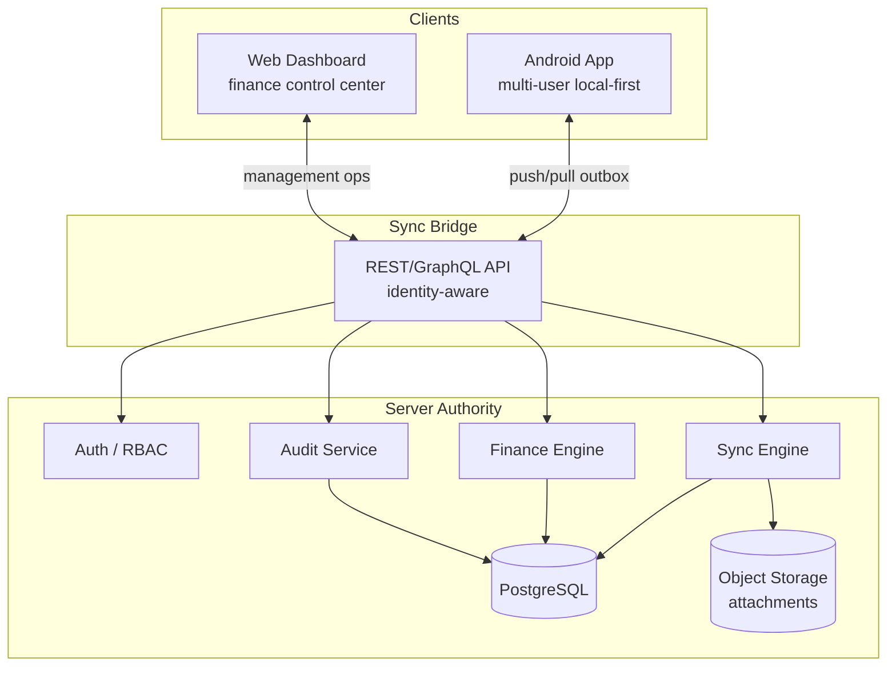

# FundManager V2 — Architecture

## System Context



---

## Android Layer Architecture (Current + Planned)

```
ui/screen/*          ViewModels, Compose screens
ui/navigation/       NavHost, Screen routes
ui/component/        Shared composables

domain/
  model/             DomainModels, ProjectSummary, LegacyModels
  repository/        FundsRepository (interface)
  usecase/           Business logic (summary SSOT here)
  service/           FileStorage, ReportFile, ExportCsv

data/
  local/             Room entities, DAOs, AppDatabase, migrations
  repository/        FundsRepositoryImpl
  service/           FileStorageServiceImpl, ReportFileRepositoryImpl
  mapper/            Entity ↔ Domain mappers
  sync/              [Phase 3] outbox, pull handler, attachment queue

di/                  Hilt modules
```

---

## Data Flow — Local Transaction Save (unchanged)

```
TransactionFormScreen
  → TransactionFormViewModel
  → ValidateTransactionUseCase
  → FundsRepository.insertTransaction()
  → TransactionDao + AuditLogDao
  → Room DB
```

Future (Phase 3): same path + enqueue to `sync_outbox` scoped by session.

---

## Data Flow — Summary Display

```
DashboardScreen / DashboardHomeScreen
  → ViewModel
  → CalculateProjectSummaryUseCase  ← SSOT
  → FundsRepository.getTransactionsByProject()
  → UI renders ProjectSummary (Long amounts)
```

Future: pass `CalculationMode.LOCAL_VIEW | FINAL_APPROVED | PROJECTED`.

---

## Sync Architecture (Planned)

### Push
1. Read pending rows from `sync_outbox` WHERE userId + deviceId + sessionId
2. POST with idempotency key `{serverUserId}:{deviceId}:{operationId}`
3. On success: update `serverId`, `syncStatus=SYNCED`, `lastSyncedAt`
4. On reject: `syncStatus=REJECTED`, store server reason locally

### Pull
1. GET changes since `lastSyncedAt` for assigned projects
2. Upsert by `uuid` (never local `id`)
3. Apply approval/finance status from server

### Attachments
Separate queue; upload after transaction sync confirms `serverId`.

---

## Backend Architecture (Locked — Laravel 11)

- **Framework:** Laravel 11
- **API:** RESTful JSON API via `routes/api.php` with Laravel Sanctum token auth
- **Database:** PostgreSQL with `BIGINT` for money columns
- **Auth:** Sanctum tokens for mobile API; session-based web auth
- **Cache/Queue:** Redis
- **Queue Monitoring:** Laravel Horizon
- **File Storage:** S3-compatible object storage
- **Logging:** Laravel Monolog stack (structured JSON for production)
- **Dev/Debug:** Laravel Telescope (local/staging only)
- **Testing:** Pest + PHPUnit

---

## Web Architecture (Locked — Laravel Blade + Livewire)

- **Rendering:** Laravel Blade layouts with Livewire components
- **Styling:** Tailwind CSS (utility-first)
- **Interactivity:** Alpine.js for lightweight client interactions
- **State:** Livewire component state (no React Query)
- **Auth:** Laravel session-based auth (web), Sanctum for API calls
- **Charts:** Livewire-compatible chart library (e.g., ApexCharts via Livewire)
- **No SPA complexity.** Server-rendered HTML with Livewire wire:model for data binding.
- **Dangerous actions:** modals with reason textarea + confirm, backed by Livewire validation

---

## Cross-Cutting Concerns

| Concern | Approach |
|---------|----------|
| Money | Long (Android) / BIGINT (PostgreSQL) / BigInt (Laravel) |
| IDs | Local Long + global uuid |
| Deletes | Soft delete + void/correction |
| Audit | Local audit_logs + server audit trail (Laravel Audit) |
| Time | ISO date strings for tx date; epoch ms for timestamps |
| Logging | FileAppLogger (Android) + Laravel Monolog (server) |

---

## Deployment Topology (Target)

```
[Android devices] → [API LB] → [API servers]
[Web browsers]    → [API LB] → [API servers]
                              → [PostgreSQL primary]
                              → [Object storage]
                              → [Backup service]
```

Mobile APK distributed sideload or Play Store internal track; web on HTTPS subdomain.
